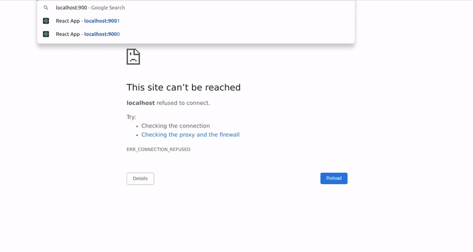

<br>

# 🍍

# STRIPE TEST

### This app will serve to test the transactions with stripe for <u>[Backend ](https://github.com/nadiamariduena/react-mern-21-backend) </u>.

<br>

<br>

---

### The pk/public key from STRIPE used in this project.

<br>

> 🔴 The pk test key I used from STRIPE is already **obsolete**, I changed it after I finished this app (to avoid **malicious attacks**)

<br>
<br>

##### [Go to final error](#final)

##### [Go to final success](#success)

#### [STRIPE KEY](#key)

---

<br>

### Install the following

- With this we will be able to require the switch for the router

```javascript
npm i react-router-dom
```

<br>

#### Switch

- add it inside the App.js

```javascript
import { BrowserRouter as Router, Switch, Route } from "react-router-dom";
```

<br>

### Create 2 routes

- PAY
- SUCCESS

<br>

```javascript
import { BrowserRouter as Router, Switch, Route } from "react-router-dom";

import Pay from "./Pay";
import Success from "./Success";
//

const App = () => {
  return (
    <Router>
      <Switch>
        <Route path="/pay">
          <Pay />
        </Route>
        {/*  */}
        <Route path="/success">
          <Success />
        </Route>
      </Switch>
    </Router>
  );
};

export default App;
```

<br>

#### PAY

```javascript
import React from "react";
import StripeCheckout from "react-stripe-checkout";

const Pay = () => {
  return (
    <div
      style={{
        height: "100vh",
        display: "flex",
        alignItems: "center",
        justifyContent: "center",
      }}
    >
      <button
        style={{
          border: "none",
          width: "120",
          borderRadius: "5",
          padding: "20px",
          backgroundColor: "black",
          color: "white",
          fontWeight: "500",
          cursor: "pointer",
        }}
      >
        PAY NOW
      </button>
    </div>
  );
};

export default Pay;
```

<br>

---

<br>

## INSTALL STRIPE

<br>

```javascript
npm install react-stripe-checkout
```

<br>

### Documentation

##### [react-stripe-checkout](https://www.npmjs.com/package/react-stripe-checkout)

<br>

#### Requirements

> **token and stripeKey** are **the only** required props, **everything else is optional** as per the stripe docs. See Checkout Docs. All props go through simple validation and are passed to stripe checkout, they're also documented in StripeCheckout.js

#### The payment

- As you can see in the documentation:

```javascript
onToken = (token) => {
  fetch("/save-stripe-token", {
    method: "POST",
    body: JSON.stringify(token),
  }).then((response) => {
    response.json().then((data) => {
      alert(`We are in business, ${data.email}`);
    });
  });
};
```

<br>

# 🍌

- When we are going to make a payment, stripe is going to return a token, and with this **token** we are going to make **payment requests** to our **nodejs server**.

<br>
<br>

## Lets use it

#### Go to the Pay.js

- import stripe
- **WRAP** the button with stripe component

```javascript
import React from "react";
import StripeCheckout from "react-stripe-checkout";

const Pay = () => {
  return (
    <div
      style={{
        height: "100vh",
        display: "flex",
        alignItems: "center",
        justifyContent: "center",
      }}
    >
      {/* 
      
              STRIPE BUTTON 
      
      
      */}
      <StripeCheckout>
        <button
          style={{
            border: "none",
            width: "120",
            borderRadius: "5",
            padding: "20px",
            backgroundColor: "black",
            color: "white",
            fontWeight: "500",
            cursor: "pointer",
          }}
        >
          PAY NOW
        </button>
      </StripeCheckout>
    </div>
  );
};

export default Pay;
```

<br>
<br>

### Now add few properties to the STRIPE wrapper

<br>

- As you can see in the [Documentation](https://www.npmjs.com/package/react-stripe-checkout), we have all this properties

<br>

##### This will give you a default Stripe-style button which looks like this:

<br>

- our **company name:** name="Three Comma Co."
- if you notice, everything is inside the button.

<br>

```javascript
<StripeCheckout
  name="Three Comma Co." // the pop-in header title
  description="Big Data Stuff" // the pop-in header subtitle
  image="https://www.vidhub.co/assets/logos/vidhub-icon-2e5c629f64ced5598a56387d4e3d0c7c.png" // the pop-in header image (default none)
  ComponentClass="div"
  panelLabel="Give Money" // prepended to the amount in the bottom pay button
  amount={1000000} // cents
  currency="USD"
  stripeKey="..."
  locale="zh"
  email="info@vidhub.co"
  // Note: Enabling either address option will give the user the ability to
  // fill out both. Addresses are sent as a second parameter in the token callback.
  shippingAddress
  billingAddress={false}
  // Note: enabling both zipCode checks and billing or shipping address will
  // cause zipCheck to be pulled from billing address (set to shipping if none provided).
  zipCode={false}
  alipay // accept Alipay (default false)
  bitcoin // accept Bitcoins (default false)
  allowRememberMe // "Remember Me" option (default true)
  token={this.onToken} // submit callback
  opened={this.onOpened} // called when the checkout popin is opened (no IE6/7)
  closed={this.onClosed} // called when the checkout popin is closed (no IE6/7)
  // Note: `reconfigureOnUpdate` should be set to true IFF, for some reason
  // you are using multiple stripe keys
  reconfigureOnUpdate={false}
  // Note: you can change the event to `onTouchTap`, `onClick`, `onTouchStart`
  // useful if you're using React-Tap-Event-Plugin
  triggerEvent="onTouchTap"
>
  <button className="btn btn-primary">
    Use your own child component, which gets wrapped in whatever component you
    pass into as "ComponentClass" (defaults to span)
  </button>
</StripeCheckout>
```

<br>

#### 🔴

#### Important properties from the above code:

```javascript
        token={this.onToken}// submit callback
        stripeKey="..."
```

##### Since its sensitive data, we will have to create a function to handle it

## Lets grab the properties from stripe and add it to the button

```javascript
<StripeCheckout
  name="NOVE shop"
  image="https://avatars.githubusercontent.com/u/1486366?v=4"
  shippingAddress
  billingAddress
  description="Your total is 20 euros"
  amount={1000}
  token={this.onToken}
  stripeKey="..."
>
  <button
    style={{
      border: "none",
      width: "120",
      borderRadius: "5",
      padding: "20px",
      backgroundColor: "black",
      color: "white",
      fontWeight: "500",
      cursor: "pointer",
    }}
  >
    PAY NOW
  </button>
</StripeCheckout>
```

<br>

<br>

### For the code below we will need the 'pk' public key from STRIPE

```javascript
stripeKey = "...";
```

<br>

🔴 **remember:**

- You have to be in test mode to grab the keys otherwise it will grab the key for real payments

<br>

- Grab the **pk** key, as we already took the **sk** key to use in our main backend project.

<br>

- Add the **pk** key to the **.env** 👍, then take the variable and add it to the button: **stripeKey={process.env.KEY}**

- change this line **token={this.onToken}** for this: **token={onToken}**

<br>

```javascript
      <StripeCheckout
        name="NOVE shop"
        image="https://avatars.githubusercontent.com/u/1486366?v=4"
        shippingAddress
        billingAddress
        description="Your total is 20 euros"
        amount={1000}
        token={onToken}
        stripeKey={process.env.KEY} // ***   HERE  ***
      >
        <button
```

<br>

#### Now add the function related to the code below

```javascript
token = { onToken };
```

#### the function

```javascript
const onToken = (token) => {
  console.log(token); //it will show us the fake order inside the browser console
};
```

#### Test it in the browser ✋

```javascript
npm start
```

- change the url:

```javascript
http://localhost:3000/pay
// After ýou click in the button it will open in the browser, but if you click it again, it will open in another window, you can just refresh the page to prevent that when testing again.
```

<br>

#### Result

- the error makes allusion to the prop, remember that we removed it, this is how it was before: **token={this.onToken}**

```javascript
Warning: Failed prop type: The prop `stripeKey` is marked as required in `ReactStripeCheckout`, but its value is `undefined`.

```

> **Failed** because of the way i set the **KEY** inside the .env

[]()

<br>

# 🐒

<br>

#### scroll to see the code ⤵️

> **SUCCESS** after i added the key inside the Pay.jsx (you shouldnt do that | only for testing purposes | never push to git when they key is visible like that), it worked!!

[]()

<br>

##### this is the fake order

```javascript
Object
card: {id: 'card_1JzfK5OCdM1Odk10RJpF27O63r', object: 'card', address_city: 'Berlin', address_country: 'Germany', address_line1: 'nanana', …}
client_ip: "52.129.28.192"
created: 1637836640
email: "nnnnn@mail.com"
id: "tok_1JzfK2OCdM1Odlk0RJcxiVw5Bg"
livemode: false
object: "token"
type: "card"
used: false
[[Prototype]]: Object
```

<br>

---

<br>

### Before we progress more, lets see what we have:

```javascript
import React from "react";
import StripeCheckout from "react-stripe-checkout";

const KEY = "pk_test_very long code";


  const onToken = (token) => {
    console.log(token);
  };

  //
  //
  //
  //
  return (
    <div
      style={{
        height: "100vh",
        display: "flex",
        alignItems: "center",
        justifyContent: "center",
      }}
    >
      <StripeCheckout
        name="NOVE shop"
        image="https://avatars.githubusercontent.com/u/1486366?v=4"
        shippingAddress
        billingAddress
        description="Your total is 20 euros"
        amount={1000}
        token={onToken}
        stripeKey={KEY}
      >
        <button
          style={{
            border: "none",
            width: "120",
            borderRadius: "5",
            padding: "20px",
            backgroundColor: "black",
            color: "white",
            fontWeight: "500",
            cursor: "pointer",
          }}
        >
          PAY NOW
        </button>
      </StripeCheckout>
    </div>
  );
};

export default Pay;
```

<br>
<br>

# :credit_card:

#### The reason why we didnt receive the payment in STRIPE, is because we haven't done yet the connection to the backend

<br>

> So to handle the backend connection, we can create an useEffect and whenever we have a **token**, we can just make backend server request

<br>

### 1. Create a useState

- import the useEffect and the useState

```javascript
import { useState, useEffect } from "react";

//
//
const [stripeToken, setStripeToken] = useState(null);
// set to (null) because we don't have a token in the beginning
//
```

<br>
<br>

#### So instead of console.log

```javascript
const onToken = (token) => {
  console.log(token);
};
```

<br>

#### we can set up the token here:

```javascript
const onToken = (token) => {
  // console.log(token);

  setStripeToken(token);
};
```

<br>
<br>

---

<br>

### For the next step we will need to install AXIOS

<br>

##### Install AXIOS

- we will need this

```javascript
npm i axios
```

<br>

> **What are Axios?** <br>
> Axios: Axios is a Javascript library used to make HTTP requests from node. js or XMLHttpRequests from the browser and it supports the Promise API that is native to JS ES6. It can be used intercept HTTP requests and responses and enables client-side protection against XSRF **(Cross-Site-Request-Forgery)**. It also has the ability to cancel requests.

<br>

#### 🔴

#### What is the difference between CSRF and XSRF?

- Cross-site scripting (or XSS) allows an attacker to execute arbitrary JavaScript within the browser of a victim user.

- Cross-site request forgery (or CSRF) allows an attacker to induce a victim user to perform actions that they do not intend to.

<br> <br>

**Why is Axios used?** <br> <br> Axios is a popular, promise-based HTTP client that sports an easy-to-use API and can be used in both the browser and Node. ... **Making HTTP requests to fetch or save data is one of the most common tasks a client-side** JavaScript application will need to do.

<br>
<br>

---

<br>

### Lets make the backend connection:

- start by integrating the axios request to the useEffect

```javascript
//
useEffect(() => {
  const makeRequest = async () => {
    try {
      //
      //
      const response = await axios.post(
        "http://localhost:3000/api/checkout/payment"
      );
      //So its going to return us the stripe response
      //
      //
    } catch (err) {
      console.log(err);
    }
  };
}, [stripeToken]);
//
//
```

### After this we will add the body and the token

- we will need to grab data from the **stripe.js** (the file is inside the main project app)

```javascript
// stripe.js
//
//
router.post("/payment", (req, res) => {
  //How i am going to charge my clients?
  stripe.charges.create(
    {
      //
      source: req.body.tokenId,
      amount: req.body.amount,
      currency: "usd",
      //https://stripe.com/docs/currencies
    },
    //
```

### add it like so

```javascript
const onToken = (token) => {
  // console.log(token);

  setStripeToken(token);
};

//
useEffect(() => {
  const makeRequest = async () => {
    try {
      //
      //
      const response = await axios.post(
        "http://localhost:3000/api/checkout/payment",

        {
          tokenId: stripeToken.id,
          amount: 2000,
        }
      );

      console.log(response.data);
    } catch (err) {
      console.log(err);
    }
  };
  //
  //if stripe token, then RUN this function
  stripeToken && makeRequest;

  //
}, [stripeToken]);
//
```

### At this point you will have some issue in the code due to this:

```javascript
stripeToken && makeRequest;
```

#### But lets try it anyway

- It didn't work

- add this and you will be able to see and test it

```javascript
if (stripeToken) {
  makeRequest();
}

//or

stripeToken && makeRequest();
```

# ✋ it worked but now i have this

```javascript

Error: Network Error
    at createError (createError.js:16)
    at XMLHttpRequest.handleError (xhr.js:117)
xhr.js:210 POST http://localhost:5000/api/checkout/payment net::ERR_CONNECTION_REFUSED

```

- the issue here was because i am using localhost 3000, and in the Pay.js i had localhost 5000, so replaced the 5000 for the 3000 and it worked

<br>

### I tested it again, now i have this error in the console

```javascript


xhr.js:210 POST http://localhost:3000/api/checkout/payment 404 (Not Found)

```

<br>

### I seems it has to do with Cors

- So i added Cors in the same way the teacher did in the video

> I Proceed to add CORS inside the main project (**server side**) where all the node backendsetup is

<br>

```javascript
const express = require("express");
const app = express();
const mongoose = require("mongoose");
const dotenv = require("dotenv");
const cors = require("cors");
//
//

//
//---------------------
//      ROUTES
//---------------------
//
//
//
const userRoute = require("./routes/user");
const authRoute = require("./routes/auth");
const productRoute = require("./routes/product");
const cartRoute = require("./routes/cart");
const orderRoute = require("./routes/order");
const stripeRoute = require("./routes/stripe");

dotenv.config();

mongoose
  .connect(process.env.MONGO_RAINBOW_URL)
  .then(() => console.log("DBConnection Successful"))
  .catch((err) => console.log("error"));
//
//
//---------------------
//      ROUTES
//---------------------
//
//
//

app.use(cors({ origin: true }));
app.use(express.json());

app.use("/api/auth", authRoute);
app.use("/api/users", userRoute);
app.use("/api/products", productRoute);
app.use("/api/carts", cartRoute);
app.use("/api/orders", orderRoute);
app.use("/api/checkout", stripeRoute);
//
//---------------------
//      SERVER
//---------------------
//
app.listen(process.env.PORT || 3000, () => {
  console.log("Backend server is running!");
});
//
```

<br>

### But it didn't work, apparently because:

#### 🔴

- You're getting a **404 because your axios call is going to your web app, not port 5000.** You need to be more explicit in your axios url like this:

##### [READ MORE](https://stackoverflow.com/questions/67090482/errorrequest-failed-with-status-code-404-at-createerror-createerror-js16-at)

> **CORS** considers the port as part of the origin, so **localhost:5000 and localhost:8080** are considered different origins here.

<br>

You might want to consider something like this which will allow you to use the same origin/domain for both the frontend code and the API during development:

- Gave me some ideas but it wasnt enough

##### [READ MORE](https://vuejs-templates.github.io/webpack/proxy.html)

<br>
 
 ### SO LETS THINK ABOUT IT

Since the web page was not served from the localhost server on localhost:3000 and via the file explorer the origin is not the same as the server API origin, hence a cross-origin request is being attempted. The browser is stopping this attempt due to CORS Policy.

###### [READ MORE](https://stackoverflow.com/questions/45975135/access-control-origin-header-error-using-axios)

<br>

---

# 🍨

## Something is being mismatched, but in my beginners mind I have just a little idea

#### 1.

> its possible that i did a mistake in the code, mostly in the pages that handle the routes and the secret stripe key.

**So I spend a couple of hours looking for errors** (but nothing), then to be sure i downloaded the teachers version just to see if it came from my code. After setting it all up with the credentials from my project, **the error persisted**

<br>

- Now i was 100% sure it didn't come from my code ✅

<br>
<br>

#### 2.

> It can be that the main reason is the server not having the same url (as it was mentioned in the articles i read), **and if that was the case i feared** that i might not know how to solve the problem, i was already thinking to continue the rest of the project and ask my teacher. but some part of me wanted to solve it alone just because of **curiosity and satisfaction**.

<br>

#### So I changed the port to lets say 4000 inside the backened and i added the url containing the localhost 4000 to the UI app

```javascript
     try {
        const res = await axios.post(
          "http://localhost:8282/api/checkout/payment",

```

##### BUT IT DIDN'T WORK!

<br>
<br>

# 🌈

## So looking for clues I found this:

##### [Error OPTIONS net::ERR_CONNECTION_REFUSED](https://stackoverflow.com/questions/45115309/error-options-neterr-connection-refused/45247822#45247822)

> **One thing is for sure, this is a backend problem. This happens when the cross origin communication between the backend and frontend is not connected properly.** Considering you have imported cors and set up the middleware, most probably you have made a mistake using the PUT method in terms of the origin URL and request URL.

<br>

##### Things you can do:

1. Make sure both servers are running (the back-end and front end). ✋ (**I didnt know they had to be running simultaneously**) because the teacher didnt say anything about it, but is okay because it wasnt a nodes course.

<br>

2. Look into google development tool and see the network section. Look at the request headers and the general. Make sure the request URL / backend has your backend server URL and the orgin / frontend has your frontend URL. 🏁 (**When i checked if the 2 matched, i knew 100% it came from there**)

<br>

3. Make sure in your http.put() method, the domain you are feeding it matches the api you set up in your server.(**the code was fine, i had set the route stripe with the endpoint: "/payment", and in the index.js i had the imported route like so ("/api/checkout", stripeRoute);**)

<br>

4. Your issue is that your backend is not connected with your front end properly,so don't waste your time trying to find other errors. **Focus on debugging the http.put() method and the cors module and middleware you have imported.**

### NOW THAT I KNEW THE ANSWERS, THE QUESTION WAS: HOW TO DO IT?

- So I spend a couple of hours trying to figure out the right question to match the right answer.

<br>
<br>

---

### If one of the problems comes every time I add the same port to both applications, its possible that I have to kill one port?

##### [Node.js Port 3000 already in use but it actually isn't?](https://stackoverflow.com/questions/39322089/node-js-port-3000-already-in-use-but-it-actually-isnt)

<br>

- Then to kill them all

```javascript
npx kill-port 3000 8080 4200 //whatever port you want to kill
```

<br>
<br>

### So I started to look for the active ports

##### [How to check if port is in use on Linux or Unix](https://www.cyberciti.biz/faq/unix-linux-check-if-port-is-in-use-command/)

```javascript
sudo lsof -i -P -n | grep LISTEN

```

##### result

```javascript
node      14546       home   23u  IPv6 209019      0t0  TCP *:4000 (LISTEN)
node      13632       home   23u  IPv4 202350      0t0  TCP *:3000 (LISTEN)
```

<br>

- Here you can really see that they dont match

<br>
<br>

# 🐒

# SOLUTION

#### So now the Question is: how to change the DEFAULT 'port 3000' from the UI REACT app?

> **""** My project is based on create-react-app. npm start or yarn start by default will run the application on port 3000 and there is no option of specifying a port in the package.json. **""**

##### [How to specify a port to run a create-react-app based project?](https://stackoverflow.com/questions/40714583/how-to-specify-a-port-to-run-a-create-react-app-based-project)

#### solution options:

- **Linux** (tested on **Ubuntu** 14.04/16.04) and MacOS (tested by @aswin-s on MacOS Sierra 10.12.4):

```javascript
"start": "PORT=3006 react-scripts start"
```

or (may be) more general solution by @IsaacPak

```javascript
"start": "export PORT=3006 react-scripts start"
```

**Windows** @JacobEnsor solution

```javascript
"start": "set PORT=3006 && react-scripts start"
```

<br>
<br>

### So I decided to test it and go for this option: 👍

- Add the following inside the package Json of the ui client app

```javascript
  "start": "export PORT=8282 && react-scripts start",
```

<br>

### THE TRICK

- **npm start** in the **server side** app, once you get this:

```javascript
Backend server is running!
DBConnection Successful
```

<br>

- You can proceed with the client, **npm start** in the UI **client side**

```javascript
// I removed my data and left this:
// its telling you that another app is using this PORT, press enter
 index.js (pid 9525)
 react-mern-21-backend

Would you like to run the app on another port instead? › (Y/n)

```

#### Once you get this question:

```javascript
Would you like to run the app on another port instead? › (Y/n)
```

#### press enter

<br>

> **If you do the opposite** it will send an error

- After the first testing in the previous apps where nothing worked (as the 'succesful' worked in the one i downloaded from git), it failed again. ✋

<br>

So i had to copy the index.js(server node, from the good one) and paste it inside the failed one, and **it worked**. 🌈

<br>

[]()

<br>

### the problem now is the organization inside the index.js (server side)

<br>
<br>

### the unsuccessful

- i think it had to do with the organization, probably some things had to be on top of others, as for what i have read the dotenv can cause issues when it not placed in the right place

```javascript
const express = require("express");
const app = express();
const mongoose = require("mongoose");
const dotenv = require("dotenv");
const cors = require("cors");
//
//

//
//---------------------
//      ROUTES
//---------------------
//
//
//
const userRoute = require("./routes/user");
const authRoute = require("./routes/auth");
const productRoute = require("./routes/product");
const cartRoute = require("./routes/cart");
const orderRoute = require("./routes/order");
const stripeRoute = require("./routes/stripe");

dotenv.config();

mongoose
  .connect(process.env.MONGO_RAINBOW_URL)
  .then(() => console.log("DBConnection Successful"))
  .catch((err) => console.log("error"));
//
//
//---------------------
//      ROUTES
//---------------------
//
//
//

app.use(cors({ origin: true }));
app.use(express.json());
//
//
app.use("/api/auth", authRoute);
app.use("/api/users", userRoute);
app.use("/api/products", productRoute);
app.use("/api/carts", cartRoute);
app.use("/api/orders", orderRoute);
app.use("/api/checkout", stripeRoute);
//
//---------------------
//      SERVER
//---------------------
//
app.listen(9000, () => {
  console.log("Backend server is running!");
});
```

## the successful

```javascript
const express = require("express");
const app = express();
const mongoose = require("mongoose");
const dotenv = require("dotenv");

const cors = require("cors");

dotenv.config();

mongoose
  .connect(process.env.MONGO_RAINBOW_URL)
  .then(() => console.log("DB Connection Successfull!"))
  .catch((err) => {
    console.log(err);
  });

app.use(express.json());
app.use(cors());

// ROUTES
//
const userRoute = require("./routes/user");
const authRoute = require("./routes/auth");
const productRoute = require("./routes/product");
const cartRoute = require("./routes/cart");
const orderRoute = require("./routes/order");
const stripeRoute = require("./routes/stripe");

// LISTEN
//
app.use("/api/auth", authRoute);
app.use("/api/users", userRoute);
app.use("/api/products", productRoute);
app.use("/api/carts", cartRoute);
app.use("/api/orders", orderRoute);
app.use("/api/checkout", stripeRoute);

// app.listen(process.env.PORT || 5000, () => {
//   console.log("Backend server is running!");
// });
app.listen(9000, () => {
  console.log("Backend server is running! port 9000");
});
```

<br>
<br>

# Testing

- I wanted to know what exactly can cause issues depending of the place i add them.

**dotenv** ✋

<br>

```javascript
const express = require("express");
const app = express();
const mongoose = require("mongoose");
const dotenv = require("dotenv");

const cors = require("cors");

mongoose
  .connect(process.env.MONGO_RAINBOW_URL)
  .then(() => console.log("DB Connection Successfull!"))
  .catch((err) => {
    console.log(err);
  });

app.use(express.json());
app.use(cors());

// ROUTES
//
const userRoute = require("./routes/user");
const authRoute = require("./routes/auth");
const productRoute = require("./routes/product");
const cartRoute = require("./routes/cart");
const orderRoute = require("./routes/order");
const stripeRoute = require("./routes/stripe");
//
//
//
dotenv.config();
// LISTEN
```

- If i place the **dotenv.config();** under the routes and under mongoose(**like in the example above**),i get this error:

```javascript
MongooseError: The `uri` parameter to `openUri()` must be a string, got "undefined". Make sure the first parameter to `mongoose.connect()` or `mongoose.createConnection()` is a string.
```

<br>

<br>

<br>

---

<br>

# 🍪

# SameSite cookie issue

<br>

#### This issue wont stop our progress but it will be nice to solve it

<br>

```javascript
Indicate whether to send a cookie in a cross-site request by specifying its SameSite attribute
Because a cookie’s SameSite attribute was not set or is invalid, it defaults to SameSite=Lax, which prevents the cookie from being sent in a cross-site request. This behavior protects user data from accidentally leaking to third parties and cross-site request forgery.
Resolve this issue by updating the attributes of the cookie:
Specify SameSite=None and Secure if the cookie should be sent in cross-site requests. This enables third-party use.
Specify SameSite=Strict or SameSite=Lax if the cookie should not be sent in cross-site requests.
1 cookie
Name	Domain & Path
ab_disable_remember_me	checkout.stripe.com/api

```

<br>
<br>
<br>

### A little reading

##### [How to resolve Lighthouse's SameSite cookie issue](https://stackoverflow.com/questions/67686773/how-to-resolve-lighthouses-samesite-cookie-issue)

> The SameSite cookie attribute essentially tells the browser whether to send the cookie depending on the context of the request. There are three values the SameSite attribute can take: Strict, Lax, and None.
> <br>

**Strict** means that the cookie will be sent on a request only if the user is on the same site as the request.

<br>

**Lax** means the cookie will be also be sent on top-level navigations; i.e. if the user is navigating to the site from another site.

<br>

**None** will send the cookie on cross-site requests too. SameSite=None must also be paired with the Secure attribute, which prevents it from being sent over http:.

<br>
<br>

### [Why am I getting "Indicate whether to send a cookie in a cross-site request by specifying its SameSite attribute"?](https://stackoverflow.com/questions/63273838/why-am-i-getting-indicate-whether-to-send-a-cookie-in-a-cross-site-request-by-s)

<br>

- you are getting this because **you are using a resource from another site and that server is attempting to set a "cookie" but**, it does not have the SameSite attribute set, which is being reported in newer versions of browsers.

<br>

- this (may) also be shown if you are trying to access the server page from local computer (xampp), which generally doesn't has SSL installed;

##### set the header line in your server page (if in PHP) as below:

```javascript
header("Set-Cookie: cross-site-cookie=whatever; SameSite=None; Secure");
```

##### (remember: this must be solved from the server side.)

<br><br>

---

<br><br>

### Lets FINISH the app 🍨

<br>

# THE PROCESSING

- Next step will be to add a basic processing step

<br>

```javascript
    {stripeToken ? (
      <span>Processing. Please wait...</span>
    ) : (
      //the button data goes here

      )
```

<br>

- **read the comments** ✋

<br>

```javascript
return (
  <div
    style={{
      height: "100vh",
      display: "flex",
      alignItems: "center",
      justifyContent: "center",
    }}
  >
    {/* 
If there is a STRIPE token show "Processing please wait", but if 
there is not token, show the button


REMEMBER, this {stripeToken is being returned after client payment, 
  and after this token we are sending our backend server request:

        const res = await axios.post(
          "http://localhost:9000/api/checkout/payment",

          {
            tokenId: stripeToken.id,
            amount: 2000,
          }
        );

        AND AFTER the server request, it will return us the data, like so:

         console.log(res.data);

*/}

    {stripeToken ? (
      <span>Processing. Please wait...</span>
    ) : (
      <StripeCheckout
        name="NOVE shop"
        image="https://avatars.githubusercontent.com/u/1486366?v=4"
        shippingAddress
        billingAddress
        description="Your total is 20 euros"
        //allowRememberMe={false}
        data-allow-remember-me="false"
        amount={2000}
        token={onToken}
        stripeKey={KEY}
      >
        <button
          style={{
            border: "none",
            width: "120",
            borderRadius: "5",
            padding: "20px",
            backgroundColor: "black",
            color: "white",
            fontWeight: "500",
            cursor: "pointer",
          }}
        >
          PAY NOW
        </button>
      </StripeCheckout>
    )}
  </div>
);
```

[]()

<br><br>

---

<br><br>

# THE HISTORY hook

<br>

- With the History hook **we will redirect the user** to the SUCCESS page

```javascript
const history = useHistory();
```

<br>

- we will use this hook after the **successful operation**

```javascript
//this below is the successful operation
console.log(res.data);
//
//e are adding the history under the success transaction
// so that i will redirect the user only after the transaction
// has been accepted
history.push("/success");
```

### Dont forget to add it to the useEffect as its another dependency(read more below)

```javascript
    //
  }, [stripeToken, history]);

  //
```

<br>

---

## When use the useLocation hook

> The useLocation hook is useful in many cases when you want to trigger a function based on a change of the URL. **In general, it is used in conjunction with the useEffect** hook provided by React.

##### [React Router useLocation hook – Tutorial and Examples ](https://www.kindacode.com/article/react-router-uselocation-hook-tutorial-and-examples/)

<br>

---

<br>

# 🔴 ERROR

<br>

### When Adding the History hook to the app I encountered an error

- When restarting the server app and then the ui side app, it didnt work and it send me an error, **somehow i suspected the HISTORY** as i didnt get this error when testing the **processing**

<br>

- So i deleted the code related to the history and re started the server, and it worked. ✋

<br>

- While the server was on, i added the code related to the history inside the **ui side app** then re started the server in the **ui side** or I re started the server before i did add the code.

<br>

- In any of the 2 options **it worked** you just have to play around.

[]()

<br>

##### Here below you will find the before and after the history part

<br>

---

<br>

- BEFORE " **the history** "

```javascript
// BEFORE
import { useState, useEffect } from "react";

import StripeCheckout from "react-stripe-checkout";

const axios = require("axios");

const KEY =
  "pk_test_51JrMq0CdM1Odk0RJfHsJPW4taGQUROuQ6g9u3fCch9QU8eHNfuSrh0mGh89PF5g3IO3SPaJBsV2qzHo5Yo6An1qo00zicCUq2p";

const Pay = () => {
  //
  //
  const [stripeToken, setStripeToken] = useState(null);
  // set to (null) because we dont have a token in the beginning
  //
  //
  const onToken = (token) => {
    // console.log(token);

    setStripeToken(token);
  };

  useEffect(() => {
    const makeRequest = async () => {
      try {
        const res = await axios.post(
          "http://localhost:9000/api/checkout/payment",

          {
            tokenId: stripeToken.id,
            amount: 2000,
          }
        );

        console.log(res.data);
      } catch (err) {
        console.log(err);
      }
    };

    stripeToken && makeRequest();
    //
  }, [stripeToken]);

  //
  return (
    <div
      style={{
        height: "100vh",
        display: "flex",
        alignItems: "center",
        justifyContent: "center",
      }}
    >
      {/* 
If there is a STRIPE token show "Processing please wait", but if there is 
not token, show the button


*/}

      {stripeToken ? (
        <span>Processing. Please wait...</span>
      ) : (
        <StripeCheckout
          name="NOVE shop"
          image="https://avatars.githubusercontent.com/u/1486366?v=4"
          shippingAddress
          billingAddress
          description="Your total is 20 euros"
          //allowRememberMe={false}
          data-allow-remember-me="false"
          amount={2000}
          token={onToken}
          stripeKey={KEY}
        >
          <button
            style={{
              border: "none",
              width: "120",
              borderRadius: "5",
              padding: "20px",
              backgroundColor: "black",
              color: "white",
              fontWeight: "500",
              cursor: "pointer",
            }}
          >
            PAY NOW
          </button>
        </StripeCheckout>
      )}
    </div>
  );
};

export default Pay;
```

<br>
<br>

#### THE AFTER and the final version

🔴

- After this project is over I will **roll over the key** as it s **sensitive data**

```javascript
import { useState, useEffect } from "react";
import { useHistory } from "react-router";

import StripeCheckout from "react-stripe-checkout";

const axios = require("axios");

const KEY =
  "pk_test_51JrMq0CdM1Odk0RJfHsJPW4taGQUROuQ6g9u3fCch9QU8eHNfuSrh0mGh89PF5g3IO3SPaJBsV2qzHo5Yo6An1qo00zicCUq2p";

const Pay = () => {
  //
  //
  const [stripeToken, setStripeToken] = useState(null);
  // set to (null) because we dont have a token in the beginning
  //
  const history = useHistory();
  //
  const onToken = (token) => {
    // console.log(token);

    setStripeToken(token);
  };

  useEffect(() => {
    const makeRequest = async () => {
      try {
        const res = await axios.post(
          "http://localhost:9000/api/checkout/payment",

          {
            tokenId: stripeToken.id,
            amount: 2000,
          }
        );
        //
        //
        //this below is the successful operation
        console.log(res.data);
        //
        //e are adding the history under the success transaction
        // so that i will redirect the user only after the transaction
        // has been accepted
        history.push("/success");
        //
      } catch (err) {
        console.log(err);
      }
    };

    stripeToken && makeRequest();
    //
    //
  }, [stripeToken, history]);

  //
  return (
    <div
      style={{
        height: "100vh",
        display: "flex",
        alignItems: "center",
        justifyContent: "center",
      }}
    >
      {stripeToken ? (
        <span>Processing. Please wait...</span>
      ) : (
        <StripeCheckout
          name="NOVE shop"
          image="https://avatars.githubusercontent.com/u/1486366?v=4"
          shippingAddress
          billingAddress
          description="Your total is 20 euros"
          //allowRememberMe={false}
          data-allow-remember-me="false"
          amount={2000}
          token={onToken}
          stripeKey={KEY}
        >
          <button
            style={{
              border: "none",
              width: "120",
              borderRadius: "5",
              padding: "20px",
              backgroundColor: "black",
              color: "white",
              fontWeight: "500",
              cursor: "pointer",
            }}
          >
            PAY NOW
          </button>
        </StripeCheckout>
      )}
    </div>
  );
};

export default Pay;
```

<br>

# 🍌

# final

#### If you <u> npm start</u> only the test-transaction without being connected to the server

- You will have a **Processing. Please wait**
- And an error in the console

```javascript
Failed to load resource: the server responded with a status of 404 (Not Found)
Pay.jsx:47 Error: Request failed with status code 404
    at createError (vendors~main.chunk.js:1126)
    at settle (vendors~main.chunk.js:1397)
    at XMLHttpRequest.onloadend
```

<br>

---

<br>

# success

#### For this to work and get the final message

> - **SUCCESS, Your order is being prepared. Thanks for choosing NOVE shop**

<br>

#### You have to:

- First: Turn on the backend
- then turn on the test-transaction application

<br>

- You will get this:

> And its because the backend is already on, so just press **ENTER**

```javascript
 Something is already running on port 9000. Probably:
 react-mern-21-backend

Would you like to run the app on another port instead? › (Y/n)
```

**y** or **enter**

<br>

- This **//localhost:9001** has to match the one you have in the **[backend project](https://github.com/nadiamariduena/react-mern-21-backend/blob/master/index.js)**

<br>

- If you have problems with your server, i made a branch **[CORS AND SERVER ISSUE | err 6.](https://github.com/nadiamariduena/react-mern-21-backend/blob/master/a_ERRORS.md)** about the eventual issues you can encounter.

<br>

- Once this done, you can test it inside the browser

> http://localhost:9001/pay

<br>
<br>

## 🔑

#key

### New pk key from STRIPE

> to make this app work you have to add your own stripe keys

- the sk inside the backend
- the pk inisde the test-transaction

#### 🔴 In this project you will find _my old_ pk , so to give you an example of where you have to add it.

- this key is obsolete as i changed it after finishing this app. ✋
